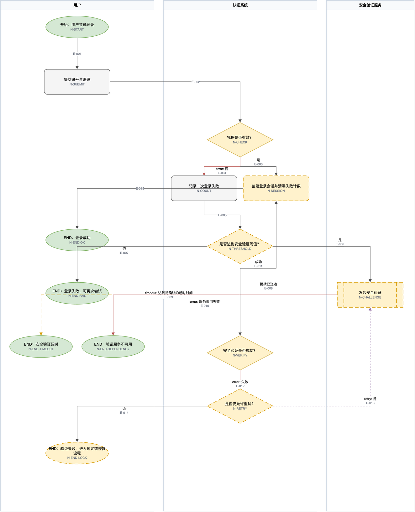

# FlowSpec

> 把模糊的软件需求变成可验证、可追踪、可直接用 draw.io 编辑的流程规格。



FlowSpec 不只是“把文字画成图”。它会区分事实、假设和信息缺口，检查异常路径、不可达节点、循环、状态冲突与失败恢复，并把需求来源追踪到节点、关键边、验收标准和测试场景。

图文件采用原生 `.drawio`；节点、边、泳道和追踪元数据都可以在 draw.io 中继续编辑。

## 为什么值得用

- 需求不完整时，不会静默编造阈值、权限、超时或重试规则。
- 不只覆盖正常路径，也检查取消、超时、依赖失败、幂等、重试和人工兜底。
- 用稳定 ID 建立 `需求来源 → 节点/边 → 验收标准 → 测试场景` 追踪。
- 将结构校验、人工评审、真实环境验证和生产证据分开报告。
- 既可以快速梳理低风险草图，也可以生成机器可校验的 FlowSpec JSON。

## 你可以直接这样说

- “把这段退款需求梳理成流程图，找出遗漏的异常分支。”
- “根据这份 PRD 生成状态流转、验收标准和测试场景。”
- “审计这个登录流程，检查不可达节点、状态冲突和失败恢复。”
- “比较两版 FlowSpec，告诉我哪些验收和测试会受影响。”
- “把这份需求直接生成 draw.io 可以打开编辑的流程图。”

不适合的请求包括：只调整配色、修复 Mermaid 语法、绘制系统架构图/时序图/ER 图、撰写完整 PRD，或提供企业级 BPMN 咨询。

## 本地加载

当前版本面向本地加载，尚未发布到 GitHub 或远程 Skill registry。

将整个 `flowspec` 目录放入支持 Agent Skills 的本地技能目录，并确认包根目录仍包含：

```text
flowspec/
├── SKILL.md
├── agents/
├── scripts/
├── references/
├── evals/
└── manifest.json
```

加载后可直接调用 `$flowspec`，或使用上面的自然语言示例触发。

## 前置条件

- [ ] Python 3.10 或更高版本：`python3 --version`
- [ ] 使用 Agent 交互时，平台需要支持 Agent Skills 或等价的本地 Skill 加载机制
- [ ] 如需打开和继续编辑图文件，安装 [draw.io Desktop](https://www.drawio.com/) 或使用 draw.io 网页版
- [ ] 不需要第三方 Python 包、API Token、账号登录或网络访问来执行本地校验与渲染

如果系统自带的 `python3` 低于 3.10，请将下列命令中的 `python3` 替换为已安装的较新解释器，例如 `python3.12`。

## 快速开始

验证示例 FlowSpec：

```bash
python3 scripts/flowspec.py validate references/login-security.example.json
```

直接生成原生 draw.io 文件：

```bash
python3 scripts/flowspec.py render \
  references/login-security.example.json \
  --output login-security.drawio
```

未指定 `--output` 时，`render` 会在输入 JSON 旁生成同名 `.drawio`。图文件输出路径必须以 `.drawio` 结尾。

为保护在 draw.io 中做过的手工调整，已有输出文件默认不会被替换。确认覆盖时显式使用：

```bash
python3 scripts/flowspec.py render \
  references/login-security.example.json \
  --output login-security.drawio \
  --force
```

生成 Markdown 评审：

```bash
python3 scripts/flowspec.py render \
  references/login-security.example.json \
  --format markdown \
  --output login-security-review.md
```

比较两个版本：

```bash
python3 scripts/flowspec.py diff before.json after.json \
  --format markdown \
  --output impact.md
```

## 它会产出什么

根据任务深度，FlowSpec 会生成或整理：

1. 已确认事实、待验证假设、阻塞问题和非阻塞问题
2. 原生 `.drawio` 流程图或状态图
3. 逻辑审计：严重度、证据、影响和建议
4. Given / When / Then 验收标准及不得发生的副作用
5. 覆盖正常、边界、错误、状态和恢复路径的测试场景
6. 需求来源、节点、关键边、验收和测试的追踪矩阵
7. 有基线时的变更影响报告

真实输出示例：

- [登录安全流程 `.drawio`](evals/fixtures/login-with-flowspec.drawio)
- [配套评审文档](evals/fixtures/login-with-flowspec.md)
- [FlowSpec JSON 示例](references/login-security.example.json)
- [退款异常恢复 `.drawio`](evals/fixtures/refund-with-flowspec.drawio)
- [退款流程评审文档](evals/fixtures/refund-with-flowspec.md)
- [退款 FlowSpec JSON](references/refund-processing.example.json)

## 输入与格式边界

Agent 可以读取需求文本、PRD、会议纪要、问题复现步骤以及现有 draw.io/Mermaid 图进行审计；本地 CLI 的机器输入是规范化 FlowSpec JSON。

图形交付采用 `.drawio`：

```text
FlowSpec JSON ──render──> 原生 .drawio
             └─review──> Markdown 评审
```

详细字段、ID、状态和追踪约束见 [模型契约](references/model-contract.md)，定稿前的人工检查见 [评审清单](references/review-checklist.md)。

## 状态与证据

| 状态 | 含义 |
|---|---|
| `draft` | 允许保留明确标注的阻塞问题和未验证假设 |
| `review_ready` | 不再有开放的阻塞问题，并已完成结构与语义检查 |
| `verified` | 仅用于已有真实证据覆盖、且不含未验证假设的范围 |

脚本通过、XML 可解析或 draw.io 能打开，只能证明结构和序列化正常，不能证明业务规则、接口能力或生产行为真实。

## 验证状态

FlowSpec 0.5.0 当前已有以下本地证据：

- 单元测试：19/19 通过
- 触发评估：19/19 通过
- 录制输出断言：2 个跨领域案例、50/50 通过
- 隔离复制后测试：19/19 通过
- `.drawio` 已由 draw.io Desktop 30.3.11 打开并导出 1324 × 1634 PNG

这些结果不是 provider-backed A/B、人工盲评、真实项目验收、跨平台兼容或生产效果证据。远程发布、远程发现和完整 `npx` 安装也尚未验证。

运行本地回归：

```bash
python3 -m unittest discover -s tests -v
python3 scripts/evaluate_outputs.py . --output reports/output-eval.json
```

维护者如已安装 `li-meta-skill`，可执行完整包校验：

```bash
LI_META_SKILL_DIR=/path/to/li-meta-skill
python3 "$LI_META_SKILL_DIR/scripts/validate_skill.py" .
```

## Troubleshooting

| 问题 | 常见原因 | 处理方式 |
|---|---|---|
| Python 报语法错误或无法解析类型标注 | Python 版本低于 3.10 | 运行 `python3 --version`，改用 Python 3.10+ |
| `Render stopped because structural errors exist` | FlowSpec 存在不可达节点、非法引用等结构错误 | 先执行 `validate` 并修复 error；仅草案可审慎使用 `--allow-invalid` |
| `draw.io output path must end with '.drawio'` | 图文件输出路径不是 `.drawio` 扩展名 | 将输出文件名改为 `.drawio` |
| `Output already exists` | 输出文件已存在，可能包含手工调整 | 换一个输出路径；确认替换时增加 `--force` |
| draw.io 可以打开，但流程规则不正确 | 结构可解析不等于业务规则真实 | 回到需求来源、接口、日志或负责人确认规则，并保持为 `draft` |
| `$flowspec` 无法触发 | Skill 未放入平台识别的目录，或根入口不完整 | 确认包根目录存在 `SKILL.md`，重新加载本地 Skill |

## 致谢

设计方法参考并裁剪自以下公开项目：

- [intent-driven-development](https://github.com/affaan-m/ECC/tree/main/skills/intent-driven-development)
- [qe-requirements-validation](https://github.com/proffesor-for-testing/agentic-qe/tree/main/.claude/skills/qe-requirements-validation)
- [requirements-author](https://github.com/microsoft/hve-core/blob/main/.github/skills/project-planning/requirements-author/SKILL.md)
- [sf-flow](https://github.com/Jaganpro/sf-skills/tree/main/skills/sf-flow)
- [draw.io](https://www.drawio.com/)

FlowSpec 只吸收适合软件产品流程验证的机制，没有复制上述项目的专有实现或未经验证的结论。

## License

当前仓库尚未提供 `LICENSE` 文件。除非后续明确补充许可证，否则不要将此目录视为已获得开源再分发授权。
